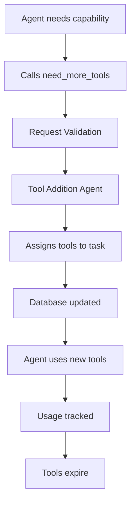

# Tool System Quick Reference

*Last updated: 2025-06-28 | Updated by: /document command*

## Overview
The MVP implements a sophisticated optional tooling system where agents start with minimal tools and can request additional capabilities as needed.

## Key Components

### 1. Database Tables
- `agent_base_permissions` - Default tools per agent type
- `task_tool_assignments` - Dynamic tool grants to tasks
- `tool_usage_events` - Complete usage audit trail
- `available_tools` - Registry of all system tools

### 2. Core Classes
- `DatabasePermissionManager` - Central permission authority
- `ToolSystemManager` - MCP server lifecycle management
- `BaseProcess` - Tool request handling in processes

### 3. MCP Servers
- **entity_manager** - Core CRUD operations (all agents)
- **message_user** - User communication (all agents)
- **file_system_listing** - Read-only file access
- **file_edit** - File modification capabilities
- **sql_lite** - Database analysis queries
- **terminal** - System command execution
- **github** - Version control operations

### 4. Core MCP Tools (Enhanced 2025-06-28)
- **break_down_task** - Recursive task decomposition
- **create_subtask** - Agent spawning and task creation
- **end_task** - ✨ **ENHANCED**: Complete task lifecycle management with automatic agent orchestration
- **need_more_context** - Knowledge expansion requests
- **need_more_tools** - Dynamic capability discovery

**Key Enhancement**: The `end_task` tool now provides comprehensive workflow orchestration:
- Database status updates with completion metadata
- Automatic triggering of `task_evaluator`, `documentation_agent`, and `summary_agent`
- Robust error handling and validation
- Full task hierarchy and context preservation

## Tool Assignment Flow



## Security Model

### Permission Levels
1. **Minimal** - entity_manager, message_user
2. **Standard** - file_system_listing, sql_lite
3. **Elevated** - file_edit, terminal, github

### Security Features
- Database-driven permissions
- Operation-level validation
- Sandboxed execution
- Time-limited assignments
- Complete audit trail

## Agent Base Tools

| Agent Type | Base Tools |
|------------|------------|
| agent_selector | entity_manager |
| planning_agent | entity_manager |
| context_addition | entity_manager, file_system_listing |
| tool_addition | entity_manager, file_system_listing |
| review_agent | entity_manager, sql_lite, file_system_listing |
| recovery_agent | entity_manager, sql_lite, terminal |
| investigator_agent | entity_manager, sql_lite |
| optimizer_agent | entity_manager, sql_lite |

## Tool Request Examples

### Database Analysis
```python
await call_tool("need_more_tools", {
    "tool_request": "database analysis capabilities",
    "justification": "Need to analyze system performance patterns"
})
# Assigns: sql_lite with specific query permissions
```

### File Editing
```python
await call_tool("need_more_tools", {
    "tool_request": "file modification capabilities",
    "justification": "Need to update configuration files"
})
# Assigns: file_edit with path restrictions
```

### System Diagnosis
```python
await call_tool("need_more_tools", {
    "tool_request": "system diagnostic tools",
    "justification": "Need to debug process issues"
})
# Assigns: terminal with command whitelist
```

## Tool Usage Pattern

```python
# 1. Check current permissions
permissions = await get_agent_permissions(agent_type, task_id)

# 2. Use available tools
if "sql_lite" in permissions.tools:
    results = await call_tool("sql_lite", "execute_query", {
        "query_name": "get_recent_events",
        "parameters": [timestamp, limit]
    })

# 3. Request if needed
if "file_edit" not in permissions.tools:
    await call_tool("need_more_tools", {
        "tool_request": "file editing",
        "justification": "Required for task completion"
    })
```

## Assignment Patterns

| Task Keywords | Assigned Tools | Duration |
|---------------|----------------|----------|
| analyze, performance, events | sql_lite | 24 hours |
| file, document, code | file_system_listing | 12 hours |
| edit, modify, write | file_edit | 8 hours |
| system, debug, diagnose | terminal | 6 hours |
| git, commit, branch | github | 48 hours |

## Best Practices

### DO:
- ✅ Request specific capabilities
- ✅ Provide clear justification
- ✅ Use base tools first
- ✅ Handle permission errors gracefully
- ✅ Cache tool results when appropriate

### DON'T:
- ❌ Request unnecessary tools
- ❌ Assume tool availability
- ❌ Ignore time limits
- ❌ Bypass permission checks
- ❌ Store sensitive data from tools

## Monitoring & Optimization

### Key Metrics
- Tool request frequency
- Assignment success rate
- Usage patterns by agent
- Execution time by tool
- Permission check overhead

### Optimization Triggers
- High-frequency tool requests → Consider base assignment
- Low usage after assignment → Reduce duration
- Repeated similar requests → Pattern detection
- Performance bottlenecks → Tool optimization

## Quick Troubleshooting

| Issue | Solution |
|-------|----------|
| Permission denied | Check agent_base_permissions and task_tool_assignments |
| Tool not found | Verify tool in available_tools table |
| Assignment failed | Check justification and security level |
| Expired access | Tool duration expired, request again |
| Slow performance | Check tool_usage_events for patterns |

## Implementation Status

✅ **Completed**
- Database schema design
- Permission model specification
- MCP server architecture
- Tool assignment logic

🚧 **In Progress**
- MCP server implementation
- Permission manager coding
- Integration with runtime

📋 **Planned**
- Usage analytics dashboard
- Optimization algorithms
- Advanced security features